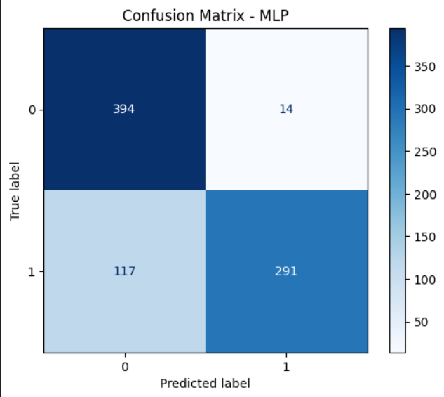
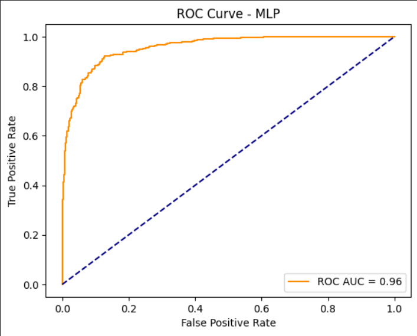

# Deepfake Audio Detection Using MFCC Features and a VGG16 + LSTM Hybrid Model

This repository implements the research paper:
**"Deepfake Audio Detection via MFCC Features Using Machine Learning"**

---

## 📌 Overview

This project identifies AI-generated (deepfake) audio using both traditional machine learning models and a hybrid deep learning architecture. Key components include:

- 🧹 Data cleaning and preprocessing
- 🎵 Extraction of MFCC and spectral features
- ⚙️ Dimensionality reduction using PCA
- 🧠 Classical ML models: SVM, Random Forest, MLP, Gradient Boosting
- 🤖 Deep learning: a fused VGG16 + LSTM architecture
- 🔍 Hyperparameter optimization via RandomizedSearchCV

---

## 📂 Dataset

**Fake-or-Real (FoR) Dataset**, containing four variants:
- `for-original`
- `for-2sec`
- `for-norm`
- `for-rerec`

---

## 📈 Key Findings

- Applying PCA cut down training time while preserving most of the accuracy.
- The VGG16 + LSTM fusion model delivered the strongest, most reliable detection performance.
- Models were evaluated using accuracy, confusion matrices, and ROC-AUC scores.

---

## 🔗 Notebook

The complete implementation is available here:
`deepfake_audio_detection.ipynb`

Also hosted on [Kaggle](https://www.kaggle.com/code/gixo95/deepfake-audio-detection-code)

---

## 🚀 Tech Stack

- Python, NumPy, Pandas
- Librosa, Matplotlib
- Scikit-learn
- TensorFlow / Keras

---

## 📦 Getting Started

```bash
git clone https://github.com/<your-username>/deepfake-audio-detection.git
cd deepfake-audio-detection
jupyter notebook deepfake_audio_detection.ipynb
```

## 📊 Results (MLP Classifier — FoR Re-recorded Subset)

### Confusion Matrix


### ROC Curve

